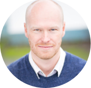

I am an applied population ecologist who takes a quantitative approach to tackling, 
reducing and resolving conservation and resource management problems in order to help 
people make difficult decisions in the face of multiple sources of uncertainty. 

 

My current research broadly focuses on: (1) the causes and consequences of variability 
in fish population dynamics, (2) improving the design and implementation of methods to 
manage aquatic ecosystems, and (3) the ecology of disease in coupled wild salmon farmed 
salmon systems. Though I have worked across a range of taxa and questions, much of my 
work is focused on the conservation and management of Pacific salmon.

In 2018 I joined the Quantitative Assessment Methods Section at [Fisheries and Oceans Canada] 
[DFO]. At DFO I am the program head for Sablefish (aka Black Cod), a long lived demersal 
species that supports a commercially important fishery off of Canada’s west coast. 
Prior to joining DFO I was a Senior Systems Ecologist and Fisheries and Aquatic Sciences 
Team lead at [ESSA Technologies][ESSA], a small consulting firm in Vancouver. Over my 5 years 
at ESSA I worked on a diversity of projects providing science advice to governments, 
NGO’s, First Nations and industry. My work included a number of projects which I 
continue to be involved in focused on Chinook salmon management and ecology in the 
large river basins of Western Alaska and the Yukon.

From 2011 to 2013 I was a postdoctoral fellow in the [School of Resource and Environmental 
Management][REM] at Simon Fraser University with Andrew Cooper and [Randall Peterman][PETERMAN]. 
We worked on salmon macroecology and the quantitative assessment of indicators of conservation status.  
I completed my [PhD][THESIS] at Simon Fraser University in the Department of Biological Sciences 
where I worked on understanding the role parasite behaviour plays in mediating pathogen 
transmission and how it can structure parasite and host populations, communities and dynamics. 
This work was based out of the “Dill” lab, a member of the Earth to Ocean Research Group 
at Simon Fraser University and the [Salmon Coast Field Station[SCOAST]] in the Broughton Archipelago.

My areas of active research include:

- Climate and ocean impacts on the spatiotemporal dynamics of fish demographics,
  e.g., [ocean currents][CURRENTS], [phytoplankton dynamics][PHYTO]
- Nonstationary dynamics of fish populations and climate effects, e.g., [time
  varying productivity][TRENDS]
- Untangling the [pathways linking climate processes and fish dynamics][BNET]
- Ecosystem based management strategies for transboundary species, e.g.,
  [Pacific salmon][EBFM] and Pacific hake

My Ph.D. thesis at Simon Fraser University examined environmental forcing
pathways linking climatic and ocean processes to dynamics of Pacific salmon
populations in the Northeast Pacific Ocean. In this work, I used a range of
quantitative modeling techniques (e.g., Bayesian hierarchical models,
probabilistic networks, and state-space models) to identify spatially coherent
effects of environmental forcing on productivity of salmon populations
throughout North America. In my M.Sc. thesis at the University of Alaska
Fairbanks, I examined how environmental forcing impacts the spatial and temporal
dynamics of coho salmon populations throughout Southeast Alaska.

[ESSA]:     https://essa.com/
[THESIS]:   http://summit.sfu.ca/system/files/iritems1/11642/etd6557_BConnors.pdf
[REM]:      http://www.sfu.ca/rem.html
[PETERMAN]: https://www.sfu.ca/rem/people/profiles/peterman.html
[SCOAST]:   https://www.salmoncoast.org/
[DFO]:      https://www.dfo-mpo.gc.ca/index-eng.htm
